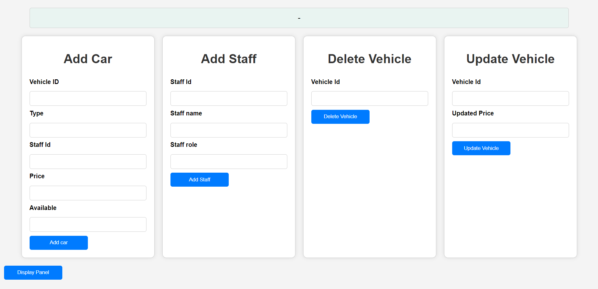

# Car Management System

This project is a simple web application for managing cars and staff in a database. It allows users to perform CRUD operations, including adding cars, adding staff, deleting vehicles, updating vehicle prices, and displaying car and staff data.

## Prerequisites

Before running this project, ensure you have the following installed on your system:

1. **Node.js** (version 12 or higher)
2. **MySQL** (database server)
3. **npm** (Node Package Manager)

## Getting Started

### 1. Clone the Repository
```bash
git clone <repository-url>
cd <repository-directory>
```

### 2. Install Dependencies
Install the required Node.js dependencies using npm:
```bash
npm install
```

### 3. Set Up MySQL Database
Create a MySQL database named `car_db`. Execute the following SQL script to create the necessary tables:
```sql
CREATE TABLE staff (
    staff_id INT PRIMARY KEY,
    staff_name VARCHAR(255),
    staff_role VARCHAR(255)
);

CREATE TABLE vehicle (
    vehicle_id INT PRIMARY KEY,
    vehicle_type VARCHAR(255),
    staff_id INT,
    price FLOAT,
    availability BOOLEAN,
    FOREIGN KEY (staff_id) REFERENCES staff(staff_id)
);
```

### 4. Update Database Credentials
Edit the database connection in the `index.js` file:

```javascript
const db = mysql.createConnection({
    host: 'localhost',
    user: 'root',
    password: '',
    database: 'car_db'
});
```
Replace `host`, `user`, `password`, and `database` with your MySQL credentials.

### 5. Run the Server
Start the Express server:

```bash
node index.js
```
The server will run at [http://localhost:3000](http://localhost:3000).

## API Endpoints

1. **Home Page**
   - **Route:** `/home`
   - **Method:** `GET`
   - **Description:** Serves the homepage.

2. **Add Car Page**
   - **Route:** `/car`
   - **Method:** `GET`
   - **Description:** Serves the add car page.

3. **Display Page**
   - **Route:** `/display`
   - **Method:** `GET`
   - **Description:** Serves the display page.

4. **Add Car**
   - **Route:** `/addCar`
   - **Method:** `POST`
   - **Description:** Adds a car to the database.
   - **Payload:**
     ```json
     {
         "vehicle_id": 1,
         "vehicle_type": "Sedan",
         "staff_id": 101,
         "price": 50000,
         "availability": true
     }
     ```

5. **Add Staff**
   - **Route:** `/addStaff`
   - **Method:** `POST`
   - **Description:** Adds a staff member to the database.
   - **Payload:**
     ```json
     {
         "staff_id": 101,
         "staff_name": "John Doe",
         "staff_role": "Manager"
     }
     ```

6. **Delete Vehicle**
   - **Route:** `/deleteVehicle`
   - **Method:** `POST`
   - **Description:** Deletes a vehicle by its ID.
   - **Payload:**
     ```json
     {
         "vehicle_id": 1
     }
     ```

7. **Update Vehicle Price**
   - **Route:** `/updatePrice`
   - **Method:** `POST`
   - **Description:** Updates the price of a vehicle by its ID.
   - **Payload:**
     ```json
     {
         "price": 60000,
         "vehicle_id": 1
     }
     ```

8. **Get Cars**
   - **Route:** `/getCars`
   - **Method:** `POST`
   - **Description:** Retrieves all cars along with their associated staff details.

## Running the Frontend

Place the `homepage.html`, `addCar.html`, and `displayPage.html` in the same directory as the `index.js` file. These files will be served through the API.

Example Workflow
1. Open http://localhost:3000/home in your browser to access the homepage.
2. Add staff and cars using the respective endpoints or pages.
3. Display cars and their associated staff.

## Screenshots

Here are some screenshots of the Car Management System in action:

### Homepage


### Admin Panel


### Display Page
